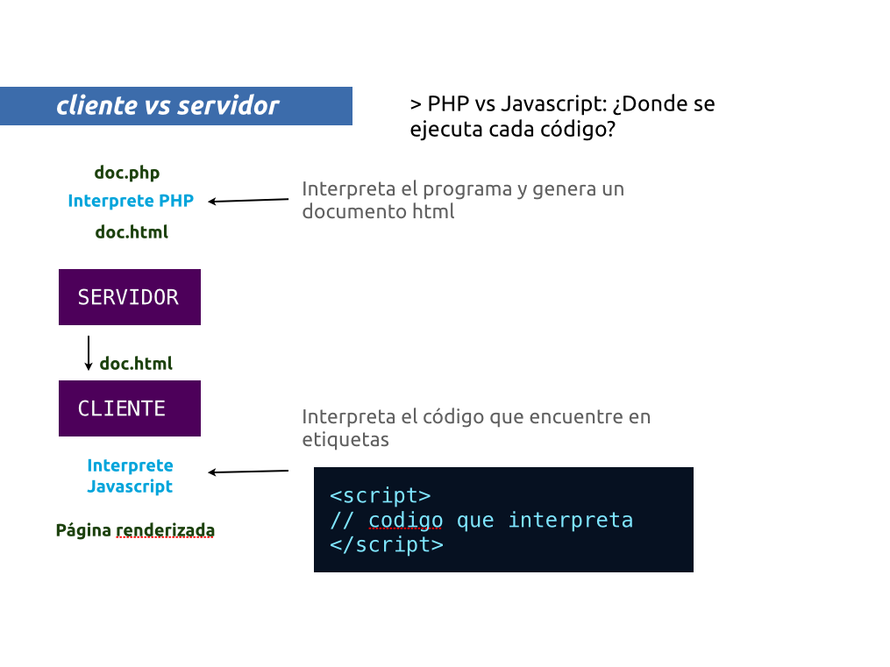

## CLASE 4
#### <?php includes ?>

#### Repaso de la sesión anterior

* Operadores lógicos
```php
($a == $b)
($a != $b)
($a > $b && $a <=$c)
($a >= $b || $b < $c)
$a == true
$b == false
```

* Condicionales
```php
if($a==”un valor”) {
	echo ‘la resupuesta 1’;
} else {
	echo ‘la respuesta 2’;
}
```

```php
if($a==$b) {
	// bloque
} else if($a==$c) {
	// bloque
} else {
	// bloque
}
```

```php
$a = 5;
if($a < 5) {
	echo "suspenso";
} else if($a <6) {
	echo "aprobado";
} else if($a <8) {
	echo "notable";
} else {
	echo "sobresaliente";
}
```

* Recojer variables por parámetros

http://localhost/?variable=1
```php
$variable = $_GET['variable'];
```

http://localhost/?a=1&b=2&c=3
```php
$a = $_GET['a'];
$b = $_GET['b'];
$c = $_GET['c'];
```

* Cliente/Servidor


### PHP Includes
http://php.net/manual/es/function.include.php

**La sentencia include incluye y evalúa el archivo especificado.**
```php
<?php include "archivo.php" ?>
```
Nos permite incluir un archivo externo.

Ejemplo:

> clase4/ejercicio1.php
```php
<?php
include "menu1.php";
?>
<h1>Página número 1</h1>
```

> clase4/ejercicio2.php
```php
<?php
include "menu1.php";
?>
<h1>Página número 2</h1>
```

> clase4/menu1.php
```php
<li><a href="ejercicio1.php">Ejercicio 1</a></li>
<li><a href="ejercicio2.php">Ejercicio 2</a></li>
```

#### Ejercicio 1

Vamos a contruir nuestro portafolio, usando 3 tipos de proyectos
(3 páginas) y construiremos un menú común.

> portafolio/index.php<br/>
> portafolio/menu.php<br/>
> portafolio/proyectos_grafico.php<br/>
> portafolio/proyectos_motion.php<br/>
> portafolio/proyectos_web.php<br/>

1. Para empezar crearemos una carpeta portafolio.
2. Los tres tipos de proyecos serán Diseño Gráfico / Motion Grafics y Diseño web
3. La página indice contendrá acceso a las tres categorías
4. El menú será compartido entre las tres páginas de proyectos.

*Este ejercicio lo subiremos al ftp de CDMON*


#### Ejercicio 2

Crearemos una sola página que en función de la hora del día, nos muestre una cabecera u otra.

- Para la mañana ( antes de las 12pm ) 
- Para la tarde ( antes de las 19pm )
- Para la noche

> horadia/index.php

1. Crearemos la carpeta hora dia
2. Archivo indice

```php
<?php if($horadia) { ?>
<h1>codigo html</h1>
<?php } else { ?>
<h1>otro html</h1>
<?php } ?>
```

#### Ejercicio 3 (Extra)

Crearemos una página que nos muestre un include en función 
del contenido que le pasemos como parámetro GET.

> get/ejercicio.php

1. Si $_GET['seccion'] == 'home'
2. include "trozo_home.php"
3. Si $_GET['seccion] == 'pagina1'
4. include "trozo_pag1.php"


### FORMULARIOS

Hemos aprendido a leer parámetros mediante GET, y las urls del navegador, 
pero estos parámetros se pueden recojer mediante un formulario html.

```php
<form action="">
	<label>Valor 1</label>
	<input type="number" name="valor1" />
	<label>Valor 2</label>
	<input type="number" name="valor2" />
	<button type="submit">Sumar</button>
</form>
```

Al ejecutarse, nuestro php, recibirá los parámetros:

- $_GET['valor1']
- $_GET['valor2']

Y podremos actuar en consecuéncia.

##### ¿Como podemos saber si una variable GET está definida?

```php
<?php
if( isset($_GET['var1']) === true ) {
	// la variable 1 existe
} else {
	// La variable 1 no existe
}
?>
```

#### Ejercicio 4

Vamos a construir la calculadora de descuentos de la sesión anterior, pero 
usando un formulario.

> calculadora/index.php
> calculadora/formulario.php

1. Creamos la carpeta y el archivo correspondiente
2. Haremos un include del formulario.php
3. Si existe la variable get con el resultado lo mostraremos de forma visual

